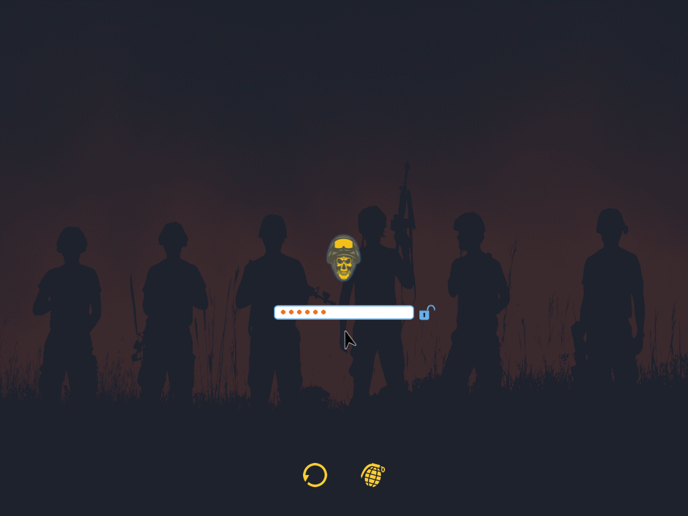
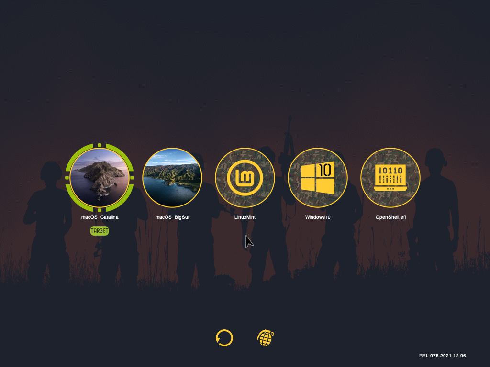
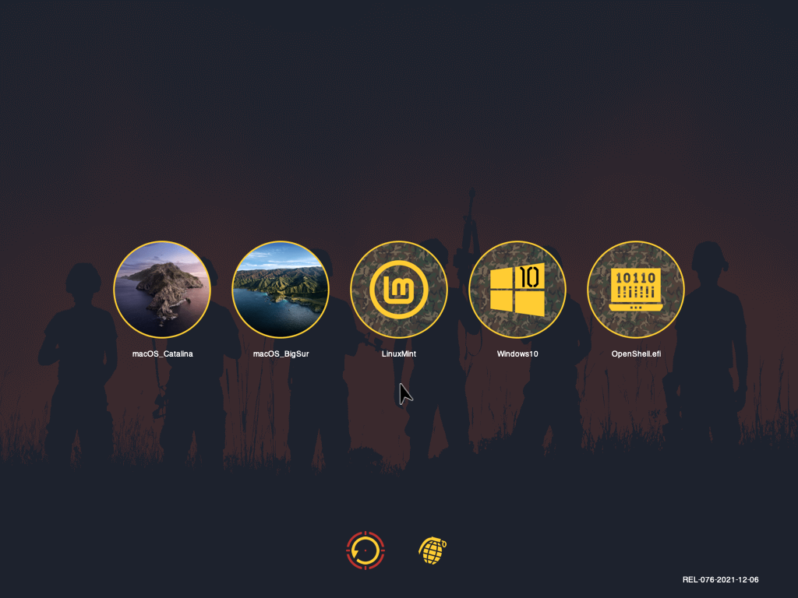
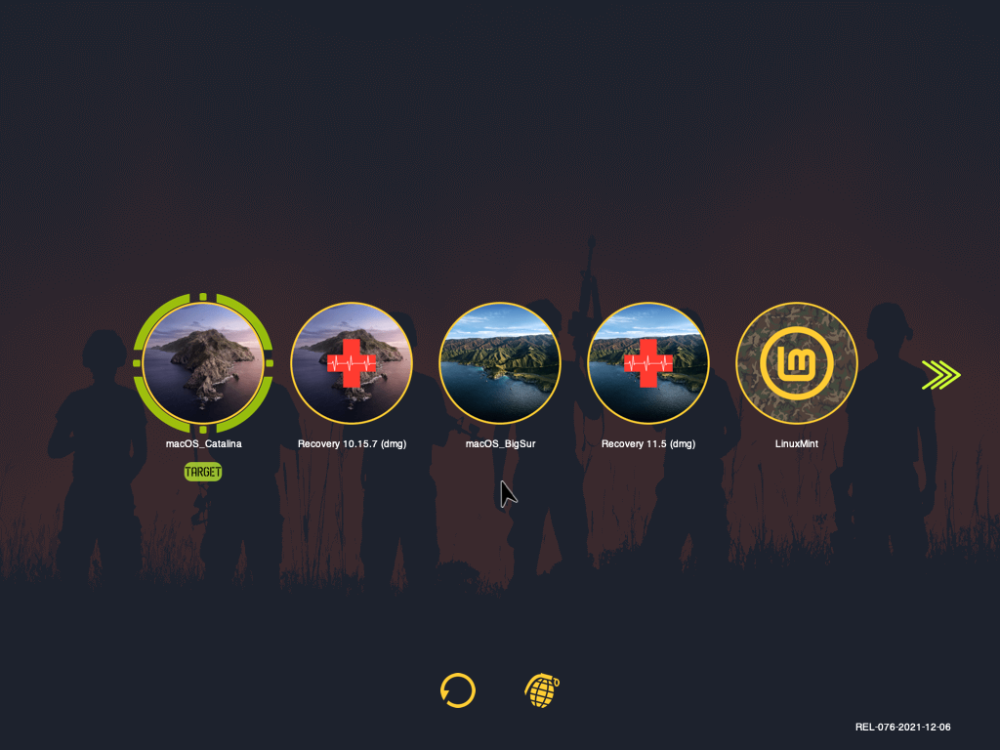
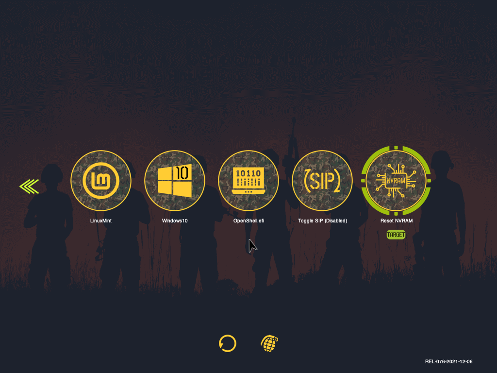

# OpenCore OpenCanopy Themes
**THEME: Antebellum**

This theme was designed with **Airsoft** aesthetics/elements and to work from **OpenCore 0.7.3 to OpenCore 0.7.6** (at the moment of writing this... December, 2021).

 

**HOW TO INSTALL:**

1 - Mount your EFI partition.

2 - DO A **FULL BACKUP OF YOUR EFI FOLDER**. Preferably in an external medium.

3 - Download the **Antebellum.zip** file.

4 - Unzip it.

5 - Copy the extracted **canemdormienti** folder to EFI/OC/Resources/**Image**.

6 - It now looks like this:

 - /EFI/OC/Resources/Image/Acidanthera/Chardonnay
 - /EFI/OC/Resources/Image/Acidanthera/GoldenGate
 - /EFI/OC/Resources/Image/Acidanthera/Syrah
 - /EFI/OC/Resources/Image/**canemdormienti/Antebellum**
 

>> Those are the basic system .icns for the theme to work properly.

![]

![]

7 - Now, open your Config.plist. Search and edit this parameters:

**Misc** 
    >**Boot**

- LauncherOption >> String >> **Full**
- LauncherPath >> String >> **Default**
- PickerAttributes >> Number >> **144**
- PickerMode >> String >> **External**
- PickerVariant >> String >> **canemdormienti\Antebellum**
- ShowPicker >> Boolean >> **True**

![]

8 - Save the Config.plist

9 - In separate archives, are also included .icns for use with the Flavours system:

- `macOS versions`
- `Recovery` and `Time Machine Flavours`
- `GNU/Linux Distros`
- `Windows versions` 
- `Backgrounds` for different display resolutions

  >>The COPYRIGHT and CREDITS belongs to the respective owners/designers of the logos, pictures, background images, icons and other elements used in this themes.
