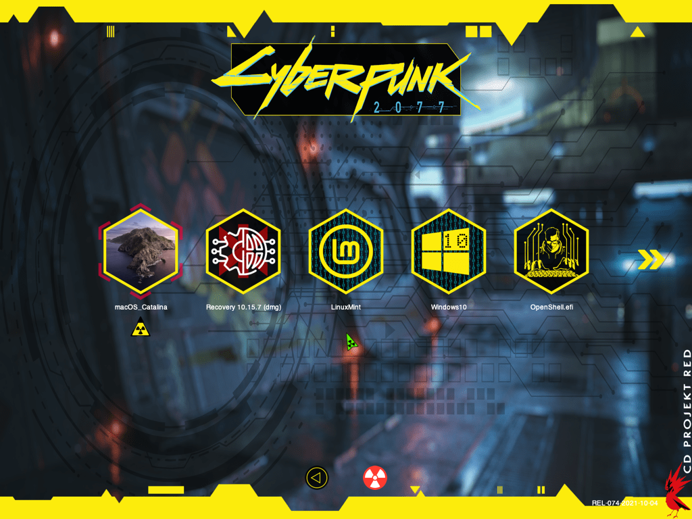
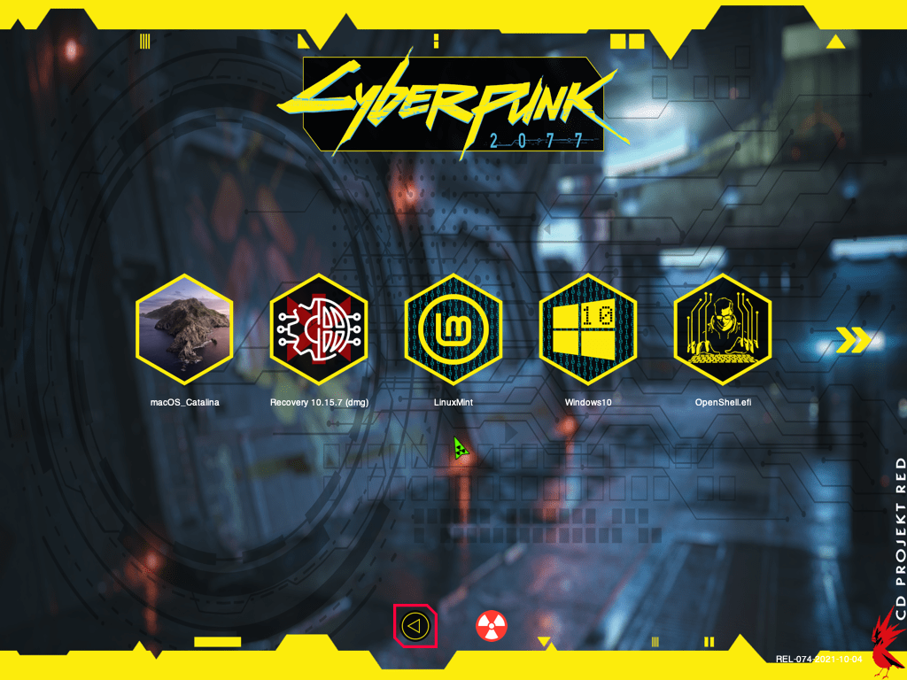
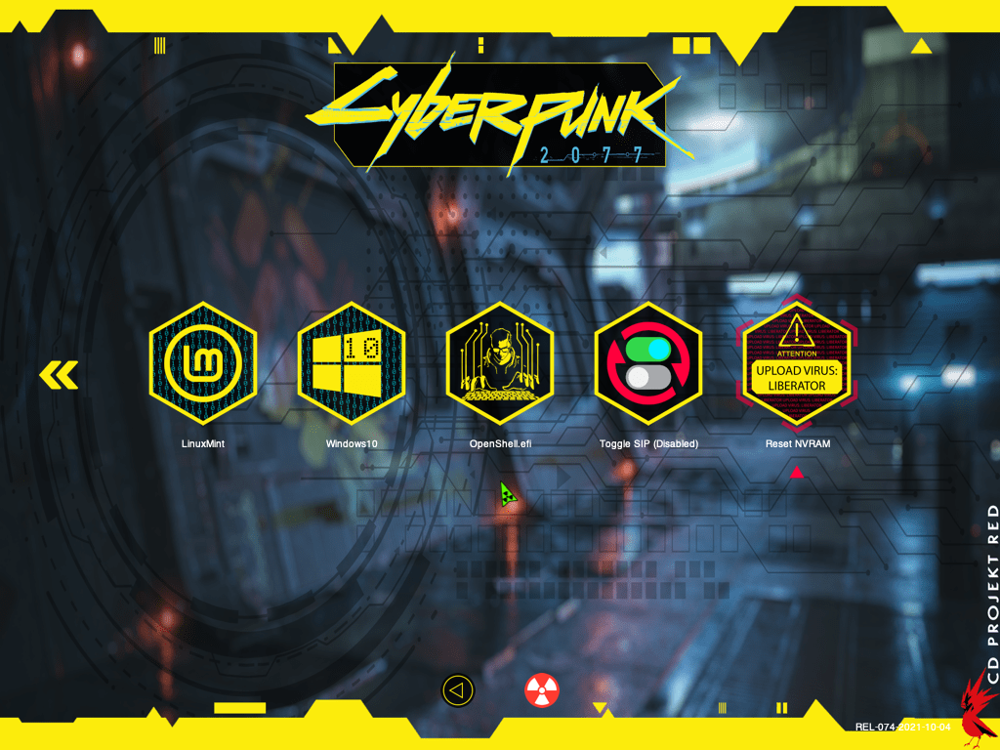
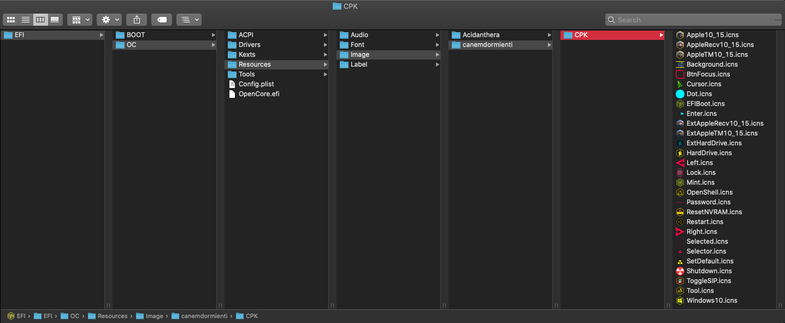
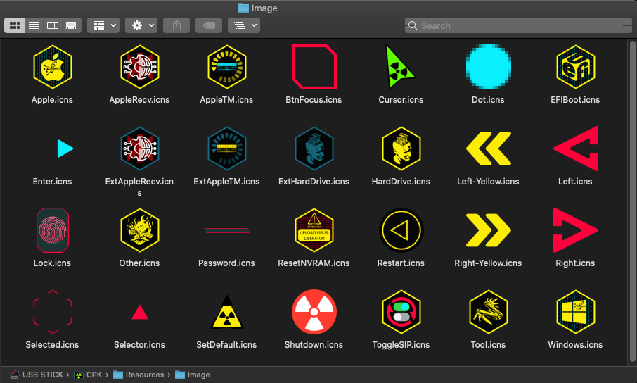
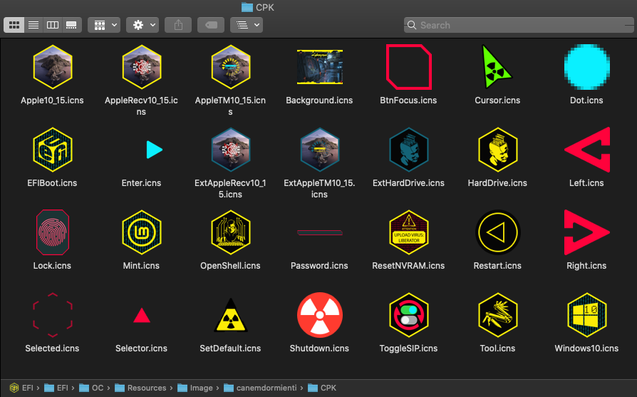
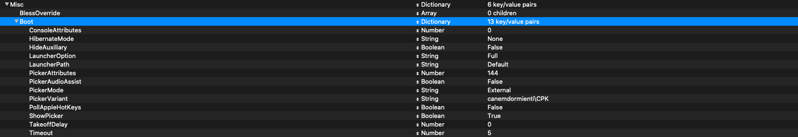
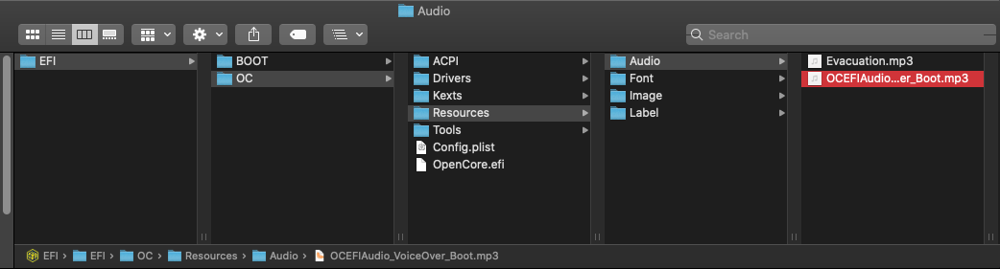
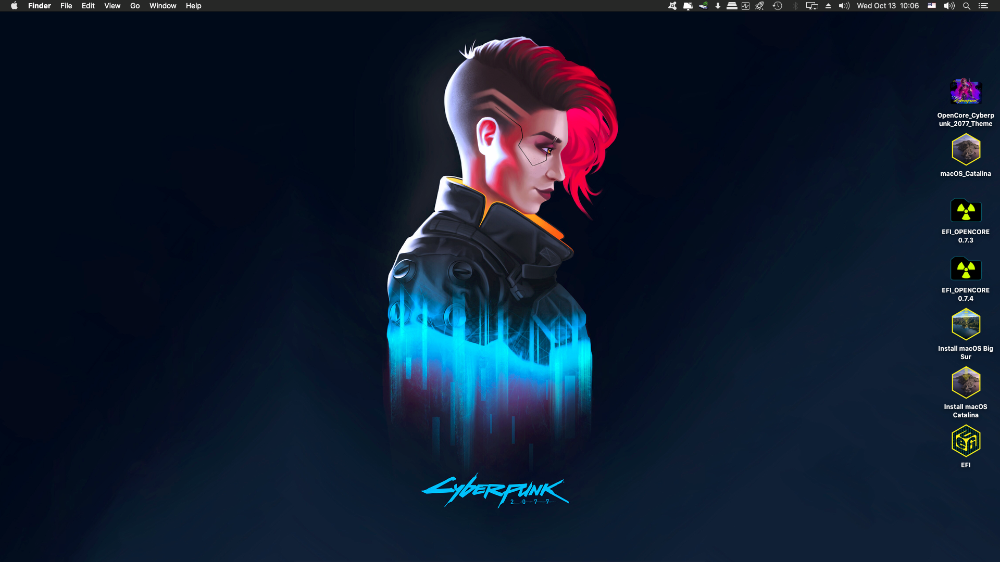

# OpenCore OpenCanopy Themes
**THEME: CPK**

This theme is intended for **OpenCore 0.7.3 to 0.7.6** (updated to comply with the Flavours system).

https://github.com/acidanthera/OpenCorePkg/blob/master/Docs/Flavours.md

It continues to work from **OpenCore 0.7.7 to OpenCore 0.7.9 (as of March, 2022). See NOTE below.**

 

**HOW TO INSTALL:**

1 - Mount your EFI partition.

2 - DO A **FULL BACKUP OF YOUR EFI FOLDER**. Preferably in an external medium.

3 - Download the **CPKv1.0-OpenCanopy-Theme** file under **Releases**.

4 - Unzip it.

5 - Copy the extracted **canemdormienti** folder to EFI/OC/Resources/**Image**.

6 - It now looks like this:

 - /EFI/OC/Resources/Image/Acidanthera/Chardonnay
 - /EFI/OC/Resources/Image/Acidanthera/GoldenGate
 - /EFI/OC/Resources/Image/Acidanthera/Syrah
 - /EFI/OC/Resources/Image/**canemdormienti/CPK**
 

>> Those are the basic system icns for the theme to work properly.

7 - Now, open your Config.plist. Search and edit this parameters:

**Misc** 
    >**Boot**

- LauncherOption >> String >> **Full**
- LauncherPath >> String >> **Default**
- PickerAttributes >> Number >> **144**
- PickerMode >> String >> **External**
- PickerVariant >> String >> **canemdormienti\CPK**
- ShowPicker >> Boolean >> **True**

**NOTE >>>> (for OpenCore 0.7.7 to 0.7.9)** 

**Due to some important updates made by the developers in the transition from the OpenCore version 0.7.6 to 0.7.7, now its MANDATORY to change the following in the config.plist (it is related to the UEFI audio part):**

https://www.insanelymac.com/forum/topic/350331-how-to-opencore-076-077-differences/

Those are the default values from the Sample.plist, so made the corrections accordingly to your needs.

8 - Save the Config.plist

9 - For those who want the Boot Chime activated:

- https://dortania.github.io/OpenCore-Post-Install/cosmetic/gui.html#setting-up-boot-chime-with-audiodxe

- There is a file named **OCEFIAudio_VoiceOver_Boot.mp3** inside CPKv1.0-OpenCanopy-Theme/Resources/**Audio**, copy it and paste/replace into this directory EFI/OC/Resources/**Audio**

10 - In separate folders, are also included icns for use with the Flavours system:

- `macOS versions`
- `Recovery` and `Time Machine Flavours`
- `GNU/Linux Distros`
- `Windows versions` 
- `Backgrounds` for different display resolutions

Some of the backgrounds were taken from here:

 - https://www.this-is-cool.co.uk/josh-marlow-sci-fi-environment-artist/
 - https://www.this-is-cool.co.uk/the-futuristic-3d-tech-art-of-amin-akhshi/
 - https://www.this-is-cool.co.uk/the-science-fiction-art-of-andrew-collins/
 - https://www.this-is-cool.co.uk/the-stunning-sci-fi-art-of-stefan-morrell/

  >>The COPYRIGHT and CREDITS belongs to the respective owners/designers of the logos, pictures, background images, icons and other elements used in this themes. I' am NOT affiliated in any way with "CD Projekt Red" or his subsidiaries.

Thank's to https://github.com/chris1111 for OpenCanopy-Generator and Background-Resizer. Those save A LOT of work...
