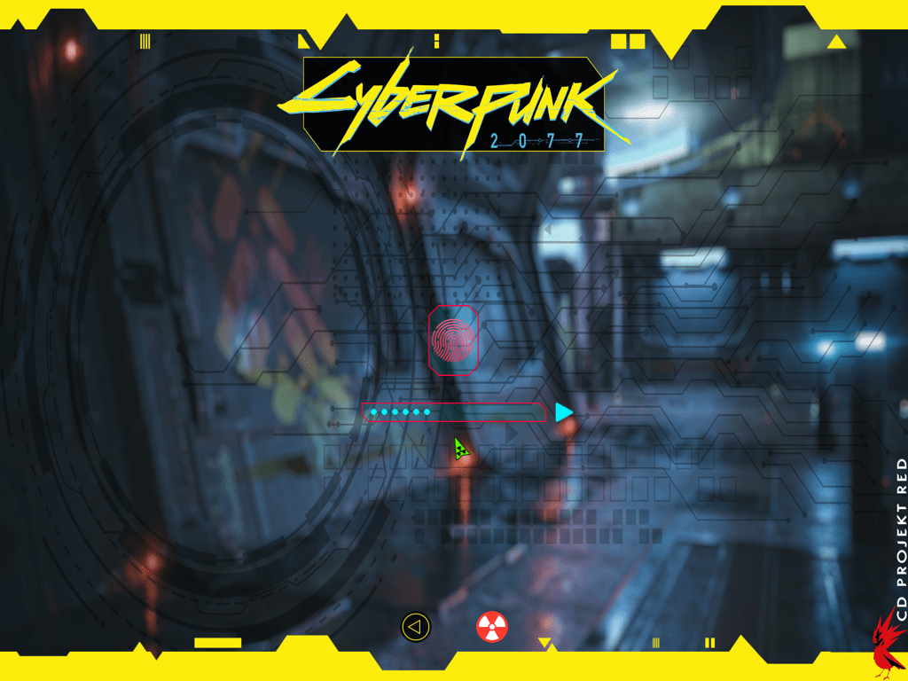

# OpenCore OpenCanopy Themes
**THEME: CPK**

This theme is intended for **OpenCore 0.7.3 and 0.7.4** (updated to comply with the Flavours system).

https://github.com/acidanthera/OpenCorePkg/blob/master/Docs/Flavours.md

 

**HOW TO INSTALL:** 

1 - Download the ZIP archive or clone the git repository.

2 - Mount your EFI partition and open the EFI folder.

3 - Go to /EFI/OC/Resources/Image/.

4 - Create a folder named **canemdormienti**.

5 - Inside that folder create another one named **CPK**.

6 - It now looks like this:

 - /EFI/OC/Resources/Image/Acidanthera/Chardonnay
 - /EFI/OC/Resources/Image/Acidanthera/GoldenGate
 - /EFI/OC/Resources/Image/Acidanthera/Syrah
 - /EFI/OC/Resources/Image/**canemdormienti**/**CPK**

7 - Copy the .icns from /OpenCore-OpenCanopy-Themes-main/CPK/Resource/Image/***.icns** and paste it in the newly created **CPK** folder. Those are the basic icns for the theme to work properly.

8 - Now, open your Config.plist. Search and edit this parameters:

**Misc** 
    **Boot**

- LauncherOption >> String >> **Full**
- LauncherPath >> String >> **Default**
- PickerAttributes >> Number >> **144**
- PickerMode >> String >> **External**
- PickerVariant >> String >> **canemdormienti** **CPK**
- ShowPicker >> Boolean >> **True**

9 - Save the Config.plist

10 - 

In separate folders, are also included icns for use with the Flavours system (macOS versions, Recovery, Time Machine, GNU/Linux Distros, Windows versions). There are, too; icns to change the appearance of the USB installers and Backgrounds for different display resolutions. 

Some of the backgrounds were taken from here:

 - https://www.this-is-cool.co.uk/josh-marlow-sci-fi-environment-artist/
 - https://www.this-is-cool.co.uk/the-futuristic-3d-tech-art-of-amin-akhshi/
 - https://www.this-is-cool.co.uk/the-science-fiction-art-of-andrew-collins/
 - https://www.this-is-cool.co.uk/the-stunning-sci-fi-art-of-stefan-morrell/

  >>The copyright and credits belongs to the respective owners/designers of the logos, pictures, background images, icons and other elements used in this themes. I' am NOT affiliated in any way with "CD Projekt Red" or his subsidiaries.

Thank's to https://github.com/chris1111 for https://github.com/chris1111/OpenCanopy-Generator and https://github.com/chris1111/Background-Resizer. Those save A LOT of work...
